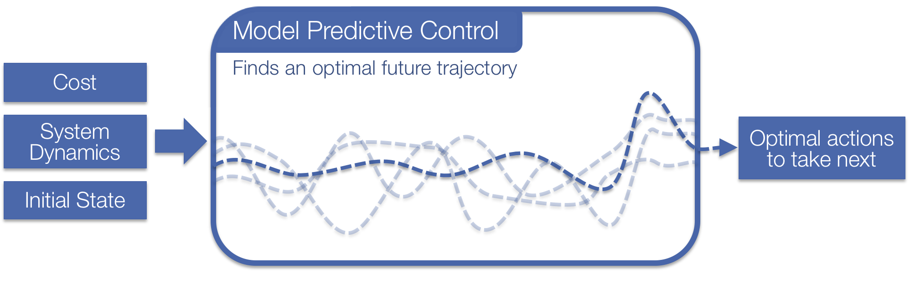
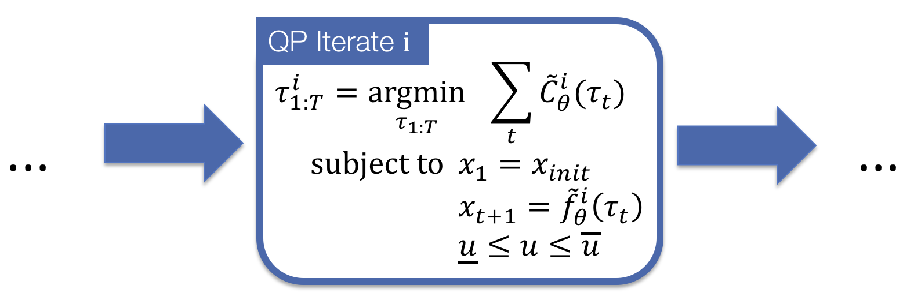
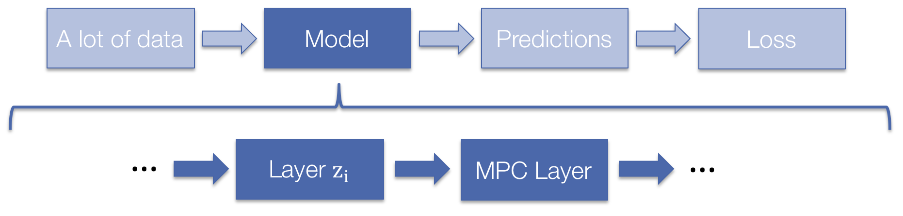

# Control is important!



[Optimal control](https://en.wikipedia.org/wiki/Control_theory)
is a widespread field that involve finding an optimal sequence of
future actions to take in a system or environment.
This is the most useful in domains when you can analytically
model your system and can easily define a cost to optimize
over your system.
This project focuses on solving
[model predictive control](https://en.wikipedia.org/wiki/Model_predictive_control)
(MPC)
with the
[box-DDP](https://homes.cs.washington.edu/~todorov/papers/TassaICRA14.pdf)
heuristic.
MPC is a powerhouse in many real-world domains ranging from
short-time horizon robot control tasks
to long-time horizon control of chemical processing plants.
More recently, the reinforcement learning community,
[strife with poor sample-complexity and instability issues
in model-free learning](http://www.argmin.net/2018/06/25/outsider-rl/),
[has](https://arxiv.org/pdf/1609.09001.pdf)
[been](https://arxiv.org/pdf/1708.02596.pdf)
[actively](https://arxiv.org/pdf/1802.09081.pdf)
[searching](https://arxiv.org/pdf/1804.00645.pdf)
[for](http://papers.nips.cc/paper/6046-value-iteration-networks.pdf)
[useful](http://papers.nips.cc/paper/7192-value-prediction-network.pdf)
[model-based](http://papersdb.cs.ualberta.ca/~papersdb/uploaded_files/505/paper_sutton-90.pdf)
[applications](https://arxiv.org/pdf/1707.06203.pdf)
[and](https://arxiv.org/pdf/1707.06170.pdf)
[priors.](https://arxiv.org/abs/1710.11417)

Going deeper, model predictive control (MPC) is the strategy of
controlling a system by repeatedly solving a model-based
optimization problem in a receding horizon fashion.
At each time step in the environment,
MPC solves the *non-convex* optimization problem

$$
\begin{equation}
\begin{split}
    x_{1:T}^\star, u_{1:T}^\star = {\rm argmin}_{x_{1:T} \in \mathcal{X},u_{1:T}\in \mathcal{U}} \;\; & \sum_{t=1}^T C_t(x_t, u_t)  \\
    \;\; {\rm subject\; to} \;\; & x_{t+1} = f(x_t, u_t) \\
    & x_1 = x_{\rm init},
\end{split}
\end{equation}
$$

where $x_t, u_t$ denote the state and control at time $t$, $\mathcal{X}$ and
$\mathcal{U}$ denote constraints on valid states and controls, $C_t : \mathcal{X}
\times \mathcal{U} \rightarrow \mathbb{R}$ is a (potentially time-varying) cost
function, $f : \mathcal{X} 
\times \mathcal{U} \rightarrow \mathcal{X}$ is a (potentially non-linear) dynamics model, and
$x_{\rm init}$ denotes the initial state of the system.
After solving this
problem, we execute the first returned control $u_1$, on the real system, step
forward in time, and repeat the process.
The MPC optimization problem can be efficiently solved with a number
of methods, for example the finite-horizon
[iterative Linear Quadratic Regulator (iLQR)](https://en.wikipedia.org/wiki/Linear%E2%80%93quadratic_regulator)
algorithm.
We focus on the
[box-DDP](https://homes.cs.washington.edu/~todorov/papers/TassaICRA14.pdf)
heuristic which adds control bounds to the problem.

# Control in PyTorch has been painful before now

There has been an indisputable rise in control and model-based
algorithms in the learning communities lately and integrating
these techniques with learning-based methods is important.
[PyTorch](http://pytorch.org) is a strong foundational
Python library for implementing and coding learning systems.
Before our library, there was a significant barrier
to integrating PyTorch learning systems with control
methods.
The appropriate data and tensors would have to be transferred
to the CPU, converted to numpy, and then passed into
1) one of the few Python control libraries, like
[python-control](https://python-control.readthedocs.io/en/latest/),
2) a hand-coded solver using CPLEX or Gurobi, or
3) your hand-rolled bindings to C/C++/matlab control
libraries such as
[fast_mpc](https://web.stanford.edu/~boyd/fast_mpc/).
Sounds like fun!

# This Library: A Differentiable PyTorch MPC Layer

We provide a PyTorch library for solving the non-convex
control problem

$$
\begin{equation}
\begin{split}
    x_{1:T}^\star, u_{1:T}^\star = {\rm argmin}_{x_{1:T} \in \mathcal{X},u_{1:T}\in \mathcal{U}} \;\; & \sum_{t=1}^T C_t(x_t, u_t)  \\
    \;\; {\rm subject\; to} \;\; & x_{t+1} = f(x_t, u_t) \\
    & x_1 = x_{\rm init},
\end{split}
\end{equation}
$$

Our code currently supports a quadratic cost function $C$
(non-quadratic support coming soon!) and
non-linear system transition dynamics $f$ that can
be defined by hand if you understand your environment
or a neural network if you don't.

## Our library is fast
We have baked in a lot of tricks to optimize the performance.
Our CPU runtime is competitive with other solvers
and our library shines brightly on the GPU as we have
implemented it with efficient GPU-based PyTorch operations.
*This lets us solve many MPC problems simultaneously
on the GPU with minimal overhead.*

(More performance results coming soon)

## Internally we solve a sequence of quadratic programs
More details on this are in the
[box-DDP](https://homes.cs.washington.edu/~todorov/papers/TassaICRA14.pdf)
paper that we implement.



# Differentiable MPC as a Layer



Our MPC layer is also differentiable!
You can do learning directly through it.
The backwards pass is nearly free.
More details on this are coming soon in our
forthcoming NIPS 2018 paper
"Differentiable MPC for End-to-end Planning and Control."

# Setup and Dependencies

+ Python/numpy/[PyTorch](https://pytorch.org)
+ You can set this project up manually by cloning the git repo
  or you can install it via pip with:

```
pip install mpc
```

# Example: Time-Varying Linear Control


import torch
from torch.autograd import Variable
from mpc import mpc

torch.manual_seed(0)

n_batch, n_state, n_ctrl, T = 2, 3, 4, 5
n_sc = n_state + n_ctrl

# Randomly initialize a PSD quadratic cost and linear dynamics.
C = torch.randn(T*n_batch, n_sc, n_sc)
C = torch.bmm(C, C.transpose(1, 2)).view(T, n_batch, n_sc, n_sc)
c = torch.randn(T, n_batch, n_sc)

alpha = 0.2
R = (torch.eye(n_state)+alpha*torch.randn(n_state, n_state)).repeat(T, n_batch, 1, 1)
S = torch.randn(T, n_batch, n_state, n_ctrl)
F = torch.cat((R, S), dim=3)

# The initial state.
x_init = torch.randn(n_batch, n_state)

# The upper and lower control bounds.
u_lower = -torch.rand(T, n_batch, n_ctrl)
u_upper = torch.rand(T, n_batch, n_ctrl)

C, c, x_init, u_lower, u_upper, F = map(Variable, [C, c, x_init, u_lower, u_upper, F])

x_lqr, u_lqr, objs_lqr = mpc.MPC(
    n_state=n_state,
    n_ctrl=n_ctrl,
    T=T,
    x_init=x_init,
    u_lower=u_lower, 
    u_upper=u_upper,
    lqr_iter=20,
    verbose=1,
    backprop=False,
    exit_unconverged=False,
    F=F,
)(C, c)


# Example: Pendulum Control

Coming soon.

# Caveats

+ Solving control optimization problems can take many iterations
  and the default parameters may not be useful for convergence on
  your problem.
  We have a `verbose` parameter so make analyzing
  the convergence easier.

# Acknowledgments

+ This website format is from
  [Caffe](http://caffe.berkeleyvision.org/).

# Citations

If you find this repository helpful for your research
please consider citing the control-limited DDP paper
and our paper on differentiable MPC.

```
@inproceedings{tassa2014control,
  title={Control-limited differential dynamic programming},
  author={Tassa, Yuval and Mansard, Nicolas and Todorov, Emo},
  booktitle={Robotics and Automation (ICRA), 2014 IEEE International Conference on},
  pages={1168--1175},
  year={2014},
  organization={IEEE}
}

@article{amos2018differentiable,
  title={Differentiable MPC for End-to-end Planning and Control},
  author={Brandon Amos and Ivan Jimenez and Jacob Sacks and Byron Boots and J. Zico Kolter},
  booktitle={Advances in neural information processing systems},
  year={2018}
}
```

# Licensing

Unless otherwise stated, the source code is copyright
Carnegie Mellon University and licensed under the
MIT License.
