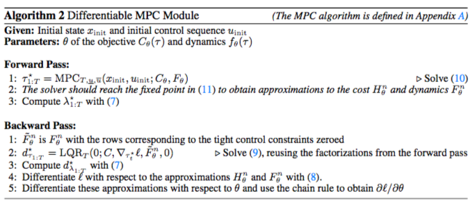
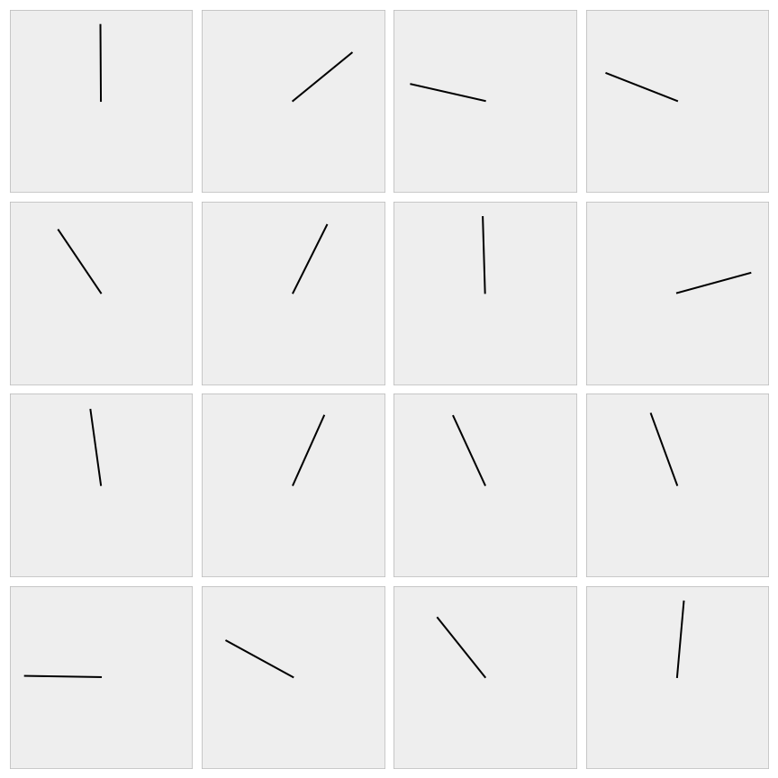
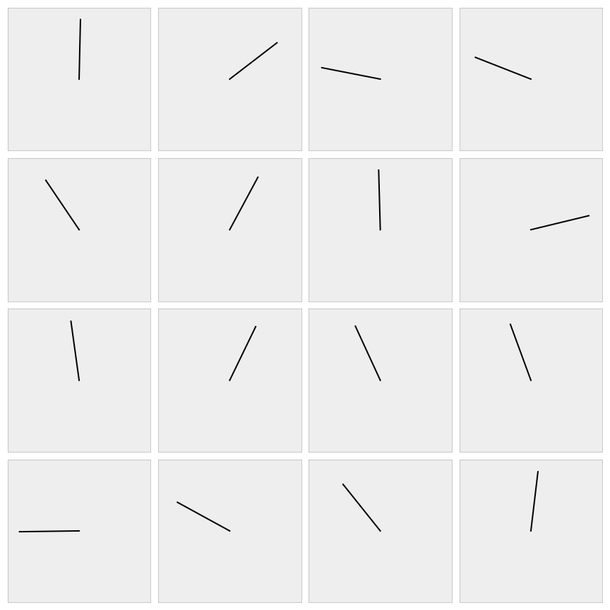
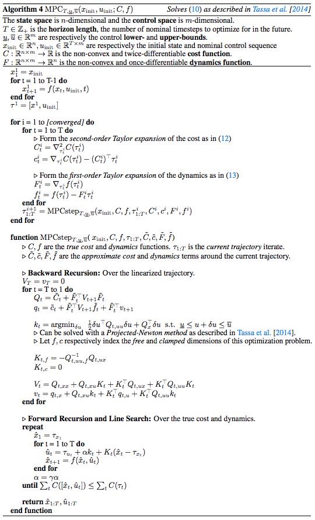

# Control is important!


[Optimal control](https://en.wikipedia.org/wiki/Control_theory)
is a widespread field that involve finding an optimal sequence of
future actions to take in a system or environment.
This is the most useful in domains when you can analytically
model your system and can easily define a cost to optimize
over your system.
This project focuses on solving
[model predictive control](https://en.wikipedia.org/wiki/Model_predictive_control)
(MPC)
with the
[box-DDP](https://homes.cs.washington.edu/~todorov/papers/TassaICRA14.pdf)
heuristic.
MPC is a powerhouse in many real-world domains ranging from
short-time horizon robot control tasks
to long-time horizon control of chemical processing plants.
More recently, the reinforcement learning community,
[strife with poor sample-complexity and instability issues
in model-free learning](http://www.argmin.net/2018/06/25/outsider-rl/),
[has](https://arxiv.org/pdf/1609.09001.pdf)
[been](https://arxiv.org/pdf/1708.02596.pdf)
[actively](https://arxiv.org/pdf/1802.09081.pdf)
[searching](https://arxiv.org/pdf/1804.00645.pdf)
[for](http://papers.nips.cc/paper/6046-value-iteration-networks.pdf)
[useful](http://papers.nips.cc/paper/7192-value-prediction-network.pdf)
[model-based](http://papersdb.cs.ualberta.ca/~papersdb/uploaded_files/505/paper_sutton-90.pdf)
[applications](https://arxiv.org/pdf/1707.06203.pdf)
[and](https://arxiv.org/pdf/1707.06170.pdf)
[priors.](https://arxiv.org/abs/1710.11417)

Going deeper, model predictive control (MPC) is the strategy of
controlling a system by repeatedly solving a model-based
optimization problem in a receding horizon fashion.
At each time step in the environment,
MPC solves the *non-convex* optimization problem

$$
\begin{equation}
\begin{split}
    x_{1:T}^\star, u_{1:T}^\star = {\rm argmin}_{x_{1:T} \in \mathcal{X},u_{1:T}\in \mathcal{U}} \;\; & \sum_{t=1}^T C_t(x_t, u_t)  \\
    \;\; {\rm subject\; to} \;\; & x_{t+1} = f(x_t, u_t) \\
    & x_1 = x_{\rm init},
\end{split}
\end{equation}
$$

where $x_t, u_t$ denote the state and control at time $t$, $\mathcal{X}$ and
$\mathcal{U}$ denote constraints on valid states and controls, $C_t : \mathcal{X}
\times \mathcal{U} \rightarrow \mathbb{R}$ is a (potentially time-varying) cost
function, $f : \mathcal{X} 
\times \mathcal{U} \rightarrow \mathcal{X}$ is a (potentially non-linear) dynamics model, and
$x_{\rm init}$ denotes the initial state of the system.
After solving this
problem, we execute the first returned control $u_1$, on the real system, step
forward in time, and repeat the process.
The MPC optimization problem can be efficiently solved with a number
of methods, for example the finite-horizon
[iterative Linear Quadratic Regulator (iLQR)](https://en.wikipedia.org/wiki/Linear%E2%80%93quadratic_regulator)
algorithm.
We focus on the
[box-DDP](https://homes.cs.washington.edu/~todorov/papers/TassaICRA14.pdf)
heuristic which adds control bounds to the problem.

# Control in PyTorch has been painful before now

There has been an indisputable rise in control and model-based
algorithms in the learning communities lately and integrating
these techniques with learning-based methods is important.
[PyTorch](http://pytorch.org) is a strong foundational
Python library for implementing and coding learning systems.
Before our library, there was a significant barrier
to integrating PyTorch learning systems with control
methods.
The appropriate data and tensors would have to be transferred
to the CPU, converted to numpy, and then passed into
1) one of the few Python control libraries, like
[python-control](https://python-control.readthedocs.io/en/latest/),
2) a hand-coded solver using CPLEX or Gurobi, or
3) your hand-rolled bindings to C/C++/matlab control
libraries such as
[fast_mpc](https://web.stanford.edu/~boyd/fast_mpc/).
*All of these sound like fun!*

# This Library: A Differentiable PyTorch MPC Layer

We provide a PyTorch library for solving the non-convex
control problem

$$
\begin{equation}
\begin{split}
    x_{1:T}^\star, u_{1:T}^\star = {\rm argmin}_{x_{1:T} \in \mathcal{X},u_{1:T}\in \mathcal{U}} \;\; & \sum_{t=1}^T C_t(x_t, u_t)  \\
    \;\; {\rm subject\; to} \;\; & x_{t+1} = f(x_t, u_t) \\
    & x_1 = x_{\rm init},
\end{split}
\end{equation}
$$

Our code currently supports a quadratic cost function $C$
(non-quadratic support coming soon!) and
non-linear system transition dynamics $f$ that can
be defined by hand if you understand your environment
or a neural network if you don't.

## Our library is fast
We have baked in a lot of tricks to optimize the performance.
Our CPU runtime is competitive with other solvers
and our library shines brightly on the GPU as we have
implemented it with efficient GPU-based PyTorch operations.
*This lets us solve many MPC problems simultaneously
on the GPU with minimal overhead.*

## Internally we solve a sequence of quadratic programs
More details on this are in the
[box-DDP](https://homes.cs.washington.edu/~todorov/papers/TassaICRA14.pdf)
paper that we implement.


# Differentiable MPC as a Layer




Our MPC layer is also differentiable!
You can do learning directly through it.
The backwards pass is nearly free.
More details on this are in our NIPS 2018 paper
[Differentiable MPC for End-to-end Planning and Control](https://arxiv.org/abs/1810.13400).

## Differentiable MPC and fixed points
Sometimes the controller does not run for long enough to reach a
fixed point, or a fixed point doesn't exist, which often happens when
using neural networks to approximate the dynamics.
When this happens, our solver cannot be used to differentiate
through the controller, because it assumes a fixed point happens.
Differentiating through the final iLQR iterate that's not
a fixed point will usually give the wrong gradients.
Treating the iLQR procedure as a compute graph and differentiating through
the unrolled operations is a reasonable alternative in this scenario that
obtains surrogate gradients to the control problem, but
this is not currently implemented as an option in this library.

To help catch fixed-point differentiation errors, our
solver has the options `exit_unconverged` that forcefully
exits the program if a fixed-point is not hit
(to make sure users are aware of this issue) and
`detach_unconverged` that more silently detaches unconverged examples
from the batch so that they are not differentiated through.

# Setup and Dependencies

+ Python/numpy/[PyTorch](https://pytorch.org)
+ You can set this project up manually by cloning the git repo
  or you can install it via pip with:

```
pip install mpc
```

# Dynamics Jacobian Computation Modes

Our approach to MPC requires that the dynamics function
$f(\tau)$ where $\tau=[x u]$ is linearized at each time step
around the current iterate $\tau_i$
by computing the first-order Taylor expansion as

$$\tilde f(\tau) = f(\tau_i) + \nabla_\tau f(\tau_i) (\tau-\tau_i).$$

Depending on what function you are using to model your dynamics
computing $\nabla_\tau f(\tau_i)$ may be easy or difficult
to implement. We provide three options of how our solver
internally computes $\nabla_\tau f(\tau_i)$ that
are passed in to the solver as the `grad_method` argument.
`GradMethods` is defined in our `mpc` module.

1. `GradMethods.ANALYTIC`: Use a manually-defined Jacobian.
   The is the fastest and most accurate way to compute the Jacobian.
   Use this if possible.
   **Caveat:** We do not check the Jacobian for correctness
   and you will get silent errors if it is incorrect.
2. `GradMethods.AUTO_DIFF`: Use PyTorch's autograd.
   This is a convenient albeit slow option if you implement the
   forward pass of your dynamics with PyTorch operations
   and want to use PyTorch's automatic differentiation.
3. `GradMethods.FINITE_DIFF`: Use naive finite differences.
   This is convenient if you want to do control in non-PyTorch
   environments that don't give you easy access to the Jacobians,
   such as Mujoco/DART/Bullet simulators.
   This option may result in inaccurate Jacobians.

# Slew Rate Penalty

You can set the `slew_rate_penalty` option in our solver
to add a $\lambda$ term to the objective that penalizes the *slew rate*,
or difference between controls at adjacent timesteps:
$$\frac{\lambda}{2}||u_t-u_{t+1}||_2^2$$

This turns the control problem into:

$$
\begin{equation}
\begin{split}
    x_{1:T}^\star, u_{1:T}^\star = {\rm argmin}_{x_{1:T} \in \mathcal{X},u_{1:T}\in \mathcal{U}} \;\; & \sum_{t=1}^T C_t(x_t, u_t) + \frac{\lambda}{2}||u_t-u_{t+1}||_2^2 \\
    \;\; {\rm subject\; to} \;\; & x_{t+1} = f(x_t, u_t) \\
    & x_1 = x_{\rm init},
\end{split}
\end{equation}
$$

# Example: Time-Varying Linear Control

This example shows how our package can be used to solve
a time-varying linear control (LQR) problem of the form

$$
\begin{equation}
\begin{split}
    x_{1:T}^\star, u_{1:T}^\star = {\rm argmin}_{\tau_{1:T}=[x_{1:T},u_{1:T}]} \;\; & \sum_{t=1}^T \frac{1}{2}\tau_t^T C_t \tau_t + \tau_t^T c_t \\
    \;\; {\rm subject\; to} \;\; & x_{t+1} = F_t \tau_t + f_t \\
    & x_1 = x_{\rm init},
\end{split}
\end{equation}
$$

[This code is available in a notebook here.](https://github.com/locuslab/mpc.pytorch/blob/master/examples/Time%20Varying%20Linear-Quadratic%20Control.ipynb)


import torch
from torch.autograd import Variable
from mpc import mpc
from mpc.mpc import QuadCost, LinDx

torch.manual_seed(0)

n_batch, n_state, n_ctrl, T = 2, 3, 4, 5
n_sc = n_state + n_ctrl

# Randomly initialize a PSD quadratic cost and linear dynamics.
C = torch.randn(T*n_batch, n_sc, n_sc)
C = torch.bmm(C, C.transpose(1, 2)).view(T, n_batch, n_sc, n_sc)
c = torch.randn(T, n_batch, n_sc)

alpha = 0.2
R = (torch.eye(n_state)+alpha*torch.randn(n_state, n_state)).repeat(T, n_batch, 1, 1)
S = torch.randn(T, n_batch, n_state, n_ctrl)
F = torch.cat((R, S), dim=3)

# The initial state.
x_init = torch.randn(n_batch, n_state)

# The upper and lower control bounds.
u_lower = -torch.rand(T, n_batch, n_ctrl)
u_upper = torch.rand(T, n_batch, n_ctrl)

x_lqr, u_lqr, objs_lqr = mpc.MPC(
    n_state=n_state,
    n_ctrl=n_ctrl,
    T=T,
    u_lower=u_lower, 
    u_upper=u_upper,
    lqr_iter=20,
    verbose=1,
    backprop=False,
    exit_unconverged=False,
)(x_init, QuadCost(C, c), LinDx(F))


# Example: Pendulum Control

This example shows how to do control in a simple pendulum environment
that we have implemented in PyTorch
[here](https://github.com/locuslab/mpc.pytorch/blob/master/mpc/env_dx/pendulum.py).
The state is the cosine/sin of the angle of the pendulum and
the velocity and the control is the torque to apply.
[The full source code for this example is available in a notebook here.](https://github.com/locuslab/mpc.pytorch/blob/master/examples/Pendulum%20Control.ipynb)

We'll initialize the non-convex dynamics with:


from mpc.env_dx import pendulum
params = torch.tensor((10., 1., 1.)) # Gravity, mass, length.
dx = pendulum.PendulumDx(params, simple=True)


Let's do control to make the Pendulum swing up by solving the problem

$$
\begin{equation}
\begin{split}
    x_{1:T}^\star, u_{1:T}^\star = {\rm argmin}_{x_{1:T} \in \mathcal{X},u_{1:T}\in \mathcal{U}} \;\; & C(x_t, u_t) \\
    \;\; {\rm subject\; to} \;\; & x_{t+1} = f(x_t, u_t) \\
    & x_1 = x_{\rm init},
\end{split}
\end{equation}
$$

where the cost function $C$ is the distance from the nominal
states to the upright position.
Thus this optimization problem will find the control
sequence that minimizes this distance.
We can easily implement $C$ as the quadratic function
that takes a weighted distance as

$$C(\tau) = ||g_w\circ (\tau - \tau^\star)||_2^2$$

where $g_w$ is the weights on each component of the states
and actions and $\tau^\star$ is the goal location.
In proper quadratic form, this becomes

$$C(\tau) = \frac{1}{2}\tau^T D(g_w) \tau - (\sqrt{g_w}\circ \tau^\star)^T \tau$$

Now we can implement this function in PyTorch:


goal_weights = torch.Tensor((1., 1., 0.1))
goal_state = torch.Tensor((1., 0. ,0.))
ctrl_penalty = 0.001
q = torch.cat((
    goal_weights,
    ctrl_penalty*torch.ones(dx.n_ctrl)
))
px = -torch.sqrt(goal_weights)*goal_state
p = torch.cat((px, torch.zeros(dx.n_ctrl)))
Q = torch.diag(q).unsqueeze(0).unsqueeze(0).repeat(
    mpc_T, n_batch, 1, 1
)
p = p.unsqueeze(0).repeat(mpc_T, n_batch, 1)


Ignoring some of the more nuanced details we can
then do control with:


nominal_states, nominal_actions, nominal_objs = mpc.MPC(
    dx.n_state, dx.n_ctrl, mpc_T,
    u_init=u_init,
    u_lower=dx.lower, u_upper=dx.upper,
    lqr_iter=50,
    verbose=0,
    exit_unconverged=False,
    detach_unconverged=False,
    linesearch_decay=dx.linesearch_decay,
    max_linesearch_iter=dx.max_linesearch_iter,
    grad_method=GradMethods.AUTO_DIFF,
    eps=1e-2,
)(x, QuadCost(Q, p), dx)




## It's easy to alternatively make the Pendulum spin fast

Just set the cost to maximize the velocity $\dot \theta$
and add a ridge term because the cost needs to be SPD.

$$C(\tau) = \epsilon \frac{1}{2} \tau^T \tau - \dot \theta$$


Q = 0.001*torch.eye(dx.n_state+dx.n_ctrl).unsqueeze(0).unsqueeze(0).repeat(
    mpc_T, n_batch, 1, 1
)
p = torch.tensor((0., 0., -1., 0.))
p = p.unsqueeze(0).repeat(mpc_T, n_batch, 1)


*Voila.* 🎉



# Caveats

+ Solving control optimization problems can take many iterations
  and the default parameters may not be useful for convergence on
  your problem.
  We have a `verbose` parameter so make analyzing
  the convergence easier.

# Acknowledgments

+ This website format is from
  [Caffe](http://caffe.berkeleyvision.org/).

# Citations

If you find this repository helpful for your research
please consider citing the control-limited DDP paper
and our paper on differentiable MPC.


```
@inproceedings{tassa2014control,
  title={Control-limited differential dynamic programming},
  author={Tassa, Yuval and Mansard, Nicolas and Todorov, Emo},
  booktitle={Robotics and Automation (ICRA), 2014 IEEE International Conference on},
  pages={1168--1175},
  year={2014},
  organization={IEEE}
}

@article{amos2018differentiable,
  title={{Differentiable MPC for End-to-end Planning and Control}},
  author={Brandon Amos and Ivan Jimenez and Jacob Sacks and Byron Boots and J. Zico Kolter},
  booktitle={{Advances in Neural Information Processing Systems}},
  year={2018}
}
```


# Licensing

Unless otherwise stated, the source code is copyright
Carnegie Mellon University and licensed under the
MIT License.

# Appendix

## mpc.MPC Reference


class MPC(Module):
    """A differentiable box-constrained iLQR solver.

    This provides a differentiable solver for the following box-constrained
    control problem with a quadratic cost (defined by C and c) and
    non-linear dynamics (defined by f):

        min_{tau={x,u}} sum_t 0.5 tau_t^T C_t tau_t + c_t^T tau_t
                        s.t. x_{t+1} = f(x_t, u_t)
                            x_0 = x_init
                            u_lower <= u <= u_upper

    This implements the Control-Limited Differential Dynamic Programming
    paper with a first-order approximation to the non-linear dynamics:
    https://homes.cs.washington.edu/~todorov/papers/TassaICRA14.pdf

    Some of the notation here is from Sergey Levine's notes:
    http://rll.berkeley.edu/deeprlcourse/f17docs/lecture_8_model_based_planning.pdf

    Required Args:
        n_state, n_ctrl, T

    Optional Args:
        u_lower, u_upper: The lower- and upper-bounds on the controls.
            These can either be floats or shaped as [T, n_batch, n_ctrl]
        u_init: The initial control sequence, useful for warm-starting:
            [T, n_batch, n_ctrl]
        lqr_iter: The number of LQR iterations to perform.
        grad_method: The method to compute the Jacobian of the dynamics.
            GradMethods.ANALYTIC: Use a manually-defined Jacobian.
                + Fast and accurate, use this if possible
            GradMethods.AUTO_DIFF: Use PyTorch's autograd.
                + Slow
            GradMethods.FINITE_DIFF: Use naive finite differences
                + Inaccurate
        delta_u (float): The amount each component of the controls
            is allowed to change in each LQR iteration.
        verbose (int):
            -1: No output or warnings
             0: Warnings
            1+: Detailed iteration info
        eps: Termination threshold, on the norm of the full control
             step (without line search)
        back_eps: `eps` value to use in the backwards pass.
        n_batch: May be necessary for now if it can't be inferred.
                 TODO: Infer, potentially remove this.
        linesearch_decay (float): Multiplicative decay factor for the
            line search.
        max_linesearch_iter (int): Can be used to disable the line search
            if 1 is used for some problems the line search can
            be harmful.
        exit_unconverged: Assert False if a fixed point is not reached.
        detach_unconverged: Detach examples from the graph that do
            not hit a fixed point so they are not differentiated through.
        backprop: Allow the solver to be differentiated through.
        slew_rate_penalty (float): Penalty term applied to
            ||u_t - u_{t+1}||_2^2 in the objective.
        prev_ctrl: The previous nominal control sequence to initialize
            the solver with.
        not_improved_lim: The number of iterations to allow that don't
            improve the objective before returning early.
        best_cost_eps: Absolute threshold for the best cost
            to be updated.
    """

    def __init__(
            self, n_state, n_ctrl, T,
            u_lower=None, u_upper=None,
            u_zero_I=None,
            u_init=None,
            lqr_iter=10,
            grad_method=GradMethods.ANALYTIC,
            delta_u=None,
            verbose=0,
            eps=1e-7,
            back_eps=1e-7,
            n_batch=None,
            linesearch_decay=0.2,
            max_linesearch_iter=10,
            exit_unconverged=True,
            detach_unconverged=True,
            backprop=True,
            slew_rate_penalty=None,
            prev_ctrl=None,
            not_improved_lim=5,
            best_cost_eps=1e-4
    ):



## MPC Algorithm


